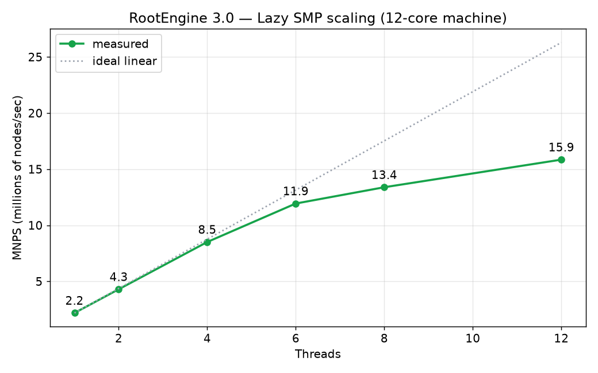
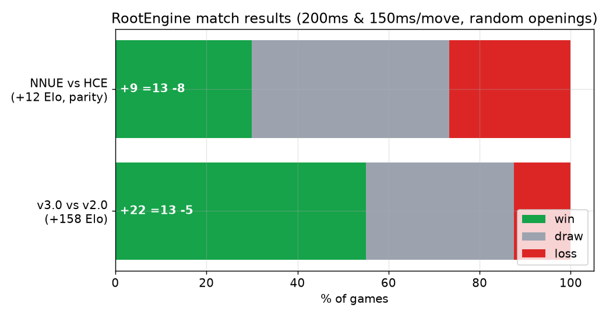
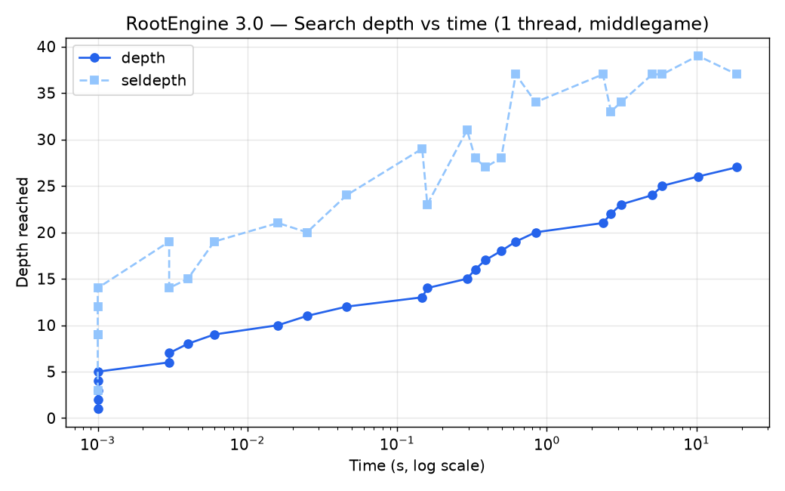

<div align="center">

# ♜ RootEngine


**A free, open-source UCI chess engine in modern C++ — magic bitboards,
Lazy SMP, Polyglot book support and an experimental NNUE with a full
in-repo training pipeline.**

[](LICENSE)
[](#building)
[](#usage)



</div>

RootEngine is a from-scratch chess engine focused on clean, dependency-free
C++20 that is easy to read, easy to measure, and easy to improve. It is
OpenBench-compatible and ships with its own match and NNUE training tools,
so anyone can contribute a patch and prove it gains Elo. This README is the
single source of documentation for the whole project: usage, building,
internals, NNUE training and contribution rules are all below.

---

## Contents

- [Features](#features)
- [Measured results](#measured-results)
- [Usage](#usage)
- [Building](#building)
- [Opening book](#opening-book)
- [NNUE: architecture and training](#nnue-architecture-and-training)
- [Testing tools](#testing-tools)
- [How the engine works](#how-the-engine-works)
- [Contributing](#contributing)
- [Roadmap](#roadmap)
- [Acknowledgements & license](#acknowledgements--license)

---

## Features

**Board & move generation**
- Bitboard representation with a mailbox for O(1) piece lookup
- Magic bitboards for sliders, generated at startup (~100 ms)
- Pseudo-legal generation + post-make legality check; perft-exact on the
  standard test suite
- Polyglot-compatible incremental Zobrist hashing, verified bit-exact
  against python-chess on the official test vectors — the same key drives
  the transposition table, repetition detection and book probing

**Search**
- Iterative deepening principal variation search (PVS) with aspiration windows
- Lazy SMP multithreading with a shared transposition table
- Null-move pruning (dynamic R), late move reductions (log-log table),
  late move pruning, futility + reverse futility, SEE pruning, internal
  iterative reduction, check extensions, mate-distance pruning
- Killer, countermove and history heuristics (gravity + malus updates)
- Quiescence search with stand-pat, SEE filtering, delta pruning and TT probing
- Full UCI time management with best-move-stability scaling

**Evaluation**
- Hand-crafted tapered evaluation (PeSTO piece-square tables + mobility,
  doubled/isolated/passed pawns, rook on open files, king shield, bishop
  pair, tempo)
- Experimental NNUE `(768→256)×2→1`, int16 quantized, trained entirely with
  the tools in this repository

**Extras**
- Native Polyglot `.bin` opening book probing (tested with Cerebellum 3 Merge)
- `bench`, `perft`, `divide`, `datagen` built into the engine
- No external dependencies — standard library only

## Measured results

Test machine: Windows 11, 12 logical cores, GCC 16.1,
`-O3 -march=x86-64-v2 -flto`. Raw CSVs and charts live in
[docs/bench](docs/bench/).

| Metric | Result |
|---|---|
| v3.0 vs v2.0 (40 games, 200 ms/move) | **+158 Elo** (+22 =13 -5, 71.2%) [95% CI +72..+267] |
| First NNUE net vs HCE (30 games, 150 ms) | parity: +12 Elo (+9 =13 -8) after ~10 min of training |
| Speed (1 thread, middlegame) | ~2.2 MNPS; depth 20 in ~1 s, depth 27 in ~19 s |
| SMP scaling | 4.3 MNPS @ 2t, 8.5 @ 4t, 15.9 @ 12t (7.2×) |
| Perft | exact on 6 standard positions; startpos perft(6) = 119,060,324 in ~3.4 s |
| Hash compatibility | 8/8 official Polyglot vectors bit-exact vs python-chess |
| Legality soak | 18 verified self-play games, 0 illegal moves, 0 crashes |
| Bench signature | `1040462 nodes` (deterministic, depth 12) |

<div align="center">


</div>

Perft reference results (all exact, CI-enforced):

| Position | Depth | Nodes |
|---|---|---|
| startpos | 6 | 119,060,324 |
| Kiwipete | 4 | 4,085,603 |
| CPW position 3 | 5 | 674,624 |
| CPW position 5 | 4 | 2,103,487 |
| CPW position 6 | 4 | 3,894,594 |

## Usage

RootEngine speaks standard [UCI](https://backscattering.de/chess/uci/).
Point any chess GUI (Arena, CuteChess, BanksiaGUI, Nibbler, …) at the
binary, or drive it from a terminal:

```
./Root
uci
setoption name Hash value 256
setoption name Threads value 4
position startpos
go movetime 3000
```

### UCI options

| Option | Default | Range | Description |
|---|---|---|---|
| `Hash` | 64 | 1–4096 | Transposition table size in MB |
| `Threads` | 1 | 1–64 | Search threads (Lazy SMP) |
| `OwnBook` | true | | Probe the Polyglot opening book before searching |
| `BookFile` | book.bin | | Path to a Polyglot `.bin` book |
| `UseNNUE` | false | | Neural network evaluation (experimental) |
| `EvalFile` | root.nnue | | Path to an RTNN `.nnue` network |

Relative `BookFile`/`EvalFile` paths are resolved against the working
directory first, then the executable's directory.

### Console commands (besides standard UCI)

| Command | Description |
|---|---|
| `bench [depth]` | Deterministic benchmark over 12 fixed positions; prints `Bench: <nodes> nodes <nps> nps`. Also available as `./Root bench` from the command line (OpenBench-compatible) |
| `perft N` | Node count to depth N from the current position |
| `divide N` | Per-root-move perft breakdown |
| `d` | Print the board and the Polyglot hash |
| `eval` | Static evaluation of the current position |
| `datagen <count> <file> <threads> <nodes>` | Generate NNUE training data via self-play |

## Building

Requires a C++20 compiler (GCC 11+ or Clang 14+). No dependencies.

```bash
make            # portable binary (x86-64-v2: any CPU from ~2009+)
make native     # fastest binary for your CPU
make debug      # -O0 -g
```

With CMake instead: `cmake -B build-cmake && cmake --build build-cmake`.

On Windows, install GCC via [WinLibs](https://winlibs.com/) or MSYS2 UCRT64;
the Makefile links statically so the binary runs standalone. CI builds and
tests Linux + Windows on every push.

## Opening book

RootEngine reads standard Polyglot `.bin` books. No book is bundled (they
are large binaries); any Polyglot book works — for example
[Cerebellum](https://zipproth.de/Brainfish/download/). Drop it next to the
engine as `book.bin`, or point `BookFile` at it.

Implementation notes: because the engine's Zobrist key *is* the Polyglot
key, probing is a direct binary search on the file with zero extra hashing.
Castling moves are translated from Polyglot's king-takes-rook encoding, and
every book move is validated against the legal move list before being
played — a book can never make the engine play an illegal move. Among the
book entries the highest-weight move is chosen (random tie-break).

## NNUE: architecture and training

### Architecture

```
(768 → 256)×2 → 1     perspective network, int16 quantized
```

- **768 inputs** per perspective: 2 colors × 6 piece types × 64 squares.
  Feature index = `rel_color * 384 + piece_type * 64 + square`, where
  `rel_color` is 0 for the perspective owner's pieces and the square is
  vertically mirrored (`sq ^ 56`) for the black perspective.
- **Two accumulators** (white/black perspective), 256 wide, shared feature
  weights, CReLU activation clamped to `[0, QA]`.
- **Output layer**: 512 → 1; the side-to-move accumulator is concatenated
  first.
- **Quantization**: `QA=255`, `QB=64`, `SCALE=400`;
  `eval_cp = raw_sum * SCALE / (QA * QB)`.

RTNN file format (little-endian):

| Field | Type | Count |
|---|---|---|
| magic | char | 4 (`"RTNN"`) |
| version | u32 | 1 |
| hidden | u32 | 1 (=256) |
| ft_weights | i16 | 768×256 |
| ft_bias | i16 | 256 |
| out_weights | i16 | 2×256 (us, them) |
| out_bias | i32 | 1 |

An experimental net is included at [`nets/root.nnue`](nets/) — trained on
300k self-play positions for 20 epochs, it already plays at parity with the
hand-crafted eval. Enable it with:

```
setoption name EvalFile value nets/root.nnue
setoption name UseNNUE value true
```

If loading fails the engine reports it via `info string` and falls back to
the hand-crafted evaluation.

### Training your own net

**1. Generate data** — inside the engine, no GUI needed:

```
./Root
datagen 1000000 train_data.csv 8 4000
```

This self-plays from random 8–9 ply openings at 4000 nodes/move and writes
`fen;score_white_cp;game_result` lines. Noisy samples are filtered
automatically: positions in check, positions whose best move is a
capture/promotion, and decided positions (|score| ≥ 1200 cp). Games are
adjudicated after 6 consecutive plies at |score| ≥ 1500. Expect roughly
1200 positions/second per 3 threads on a modern CPU.

**2. Train** — requires `pip install torch chess numpy`:

```
python tools/train_nnue.py train_data.csv nets/my.nnue 20
```

The trainer optimizes MSE between `sigmoid(prediction)` and the blended
target `(1-λ)·sigmoid(score/400) + λ·game_result` with λ = 0.3, clamps
weights to the quantization-safe range, and writes the RTNN file.

**3. Prove it with games** — a net is only better if it wins:

```
python tools/match.py ./Root_new ./Root_old 200 100
```

## Testing tools

- **`./Root bench`** — deterministic node-count signature. Report it in
  every PR; identical signature = non-functional change.
- **`tools/match.py A B [games] [movetime] [workers] [csv]`** — plays a
  match between two engine binaries with mirrored random openings,
  validates every move with python-chess (an illegal move forfeits the
  game), and reports W/D/L plus an Elo estimate with a 95% confidence
  interval.
- **`perft` / `divide`** — movegen validation; CI runs perft on every push
  and fails on any deviation.
- **`tools/train_nnue.py`** — NNUE trainer (see above).

## How the engine works

A quick tour of `src/` for new contributors:

| File | Contents |
|---|---|
| `types.h`, `bitboard.h` | Squares, colors, piece types, bit helpers, search constants |
| `attacks.h/.cpp` | Precomputed pawn/knight/king tables; magic bitboard construction for sliders |
| `position.h/.cpp` | Bitboards + mailbox, make/unmake (incl. null moves), FEN I/O, incremental Polyglot Zobrist key, repetition/50-move/insufficient-material draw detection, static exchange support (`attackers_to`) |
| `move.h`, `movelist.h` | 16-bit move encoding (from/to/4-bit flag), fixed-size scored move list with selection-sort picking |
| `movegen.h` | Pseudo-legal generation (all moves or captures-only), castling legality pre-checks, `perft` |
| `polyglot_random.h` | The official 781-entry Polyglot Random64 table |
| `search.h/.cpp` | The whole search: iterative deepening, aspiration, PVS, all prunings/reductions/extensions listed above, Lazy SMP thread management, time management, `run_sync` for bench/datagen |
| `evaluation.h/.cpp` | Tapered hand-crafted evaluation; dispatches to NNUE when active |
| `nnue.h/.cpp` | RTNN loader and quantized inference |
| `tt.h/.cpp` | Shared transposition table, depth-preferred replacement |
| `book.h/.cpp` | Polyglot book probing |
| `datagen.h/.cpp` | Multithreaded self-play training data generator |
| `uci.h/.cpp` | UCI loop, options, bench, console commands |
| `main.cpp` | Init + entry point |

Key design decisions:

- **One hash to rule them all**: the board hash follows the Polyglot
  specification exactly (including the "en passant only if capturable"
  rule), so the TT, repetition detection and book probing share a single
  incrementally-updated key with zero translation.
- **Legality by make/unmake**: move generation is pseudo-legal; after
  `make_move`, `is_legal_now()` rejects moves that leave the king en prise.
  Simple, uniform, and it makes illegal moves structurally impossible —
  including from the book and from corrupted TT entries.
- **Per-thread state, shared TT**: each search thread owns its position
  copy, killers, history and PV; only the transposition table (lock-free,
  benign races) and the stop/time state are shared.

## Contributing

Chess engines live and die by measurement. The workflow:

1. **One change per PR.** Bundled changes can't be attributed.
2. **Report the bench signature** before/after (`./Root bench`). Identical
   signature = non-functional change (refactors, docs) and needs no games.
3. **Functional changes need games.** Use `tools/match.py`, cutechess-cli
   or fastchess at a fast time control; a few hundred games minimum for
   search/eval patches, ideally an SPRT run (the engine is
   OpenBench-compatible: `make EXE=... && ./Root bench`).
4. **Perft must stay exact** if you touch movegen or make/unmake — CI
   enforces this.

Code style: C++20, no external dependencies, 4-space indent, `snake_case`,
keep hot-path code allocation-free.

Bug reports: open an issue with the FEN, the exact UCI command sequence,
expected vs actual behaviour, and your build info.

## Roadmap

Ordered roughly by expected Elo/effort ratio — pick anything:

- [ ] NNUE incremental accumulator updates (currently rebuilt per eval; the single biggest available speedup)
- [ ] Bigger nets, much more training data, SIMD affine layers
- [ ] Continuation history (1-ply / 2-ply)
- [ ] Singular extensions, multicut, probcut
- [ ] SPSA tuning of search/eval constants
- [ ] MultiPV, `ponder`, Chess960
- [ ] Syzygy endgame tablebases

## Acknowledgements & license

- [PeSTO](https://www.chessprogramming.org/PeSTO%27s_Evaluation_Function) piece-square tables by Ronald Friederich
- The [Chess Programming Wiki](https://www.chessprogramming.org) community
- [python-chess](https://github.com/niklasf/python-chess) for ground-truth verification
- Polyglot book format by Fabien Letouzey; [Cerebellum](https://zipproth.de/Brainfish/download/) book by Thomas Zipproth

Licensed under the [MIT License](LICENSE).
